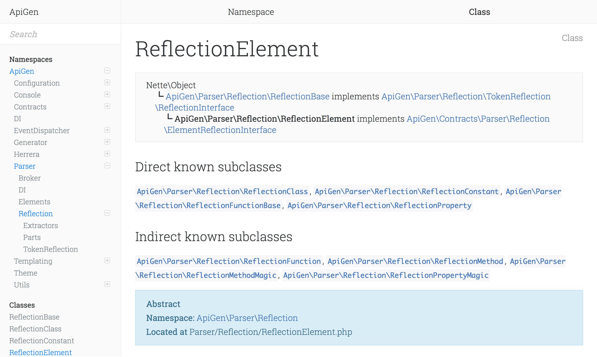

# ICanBoogie Theme for ApiGen

## Usage

Add `--template-theme icanboogie` to Apigen command like :

    apigen generate --source app --destination docs/api/v1 --template-theme icanboogie

> That is if the following PR has been merged: https://github.com/ApiGen/ApiGen/pull/777
